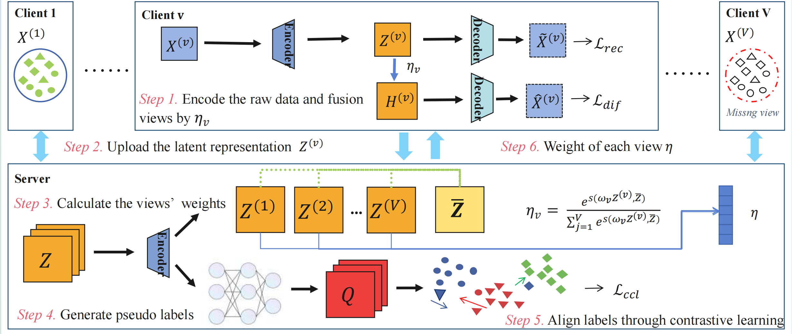

<h2 align="center">Federated Incomplete Multi-view Clustering with Cross-view 
Relationship Imputation</h2>


<p align="center">
  <b>Shuaijun Wang<sup>1,2</sup>, Hui Huang<sup>1,2</sup>, Nan Zhang<sup>1,2</sup>,Shiliang Sun<sup>3,4</sup></b>
</p>

<p align="center">
  <sup>1</sup>College of Computer Science and Artificial Intelligence, Wenzhou University, Wenzhou, China
<br>
  <sup>2</sup> Wenzhou Institute of Data Research, Wenzhou University, Wenzhou, China
<br>
  <sup>3</sup>State Key Laboratory of Submarine Geoscience,the School of 
Automation and Intelligent Sensing, Shanghai Jiao Tong University, Shanghai
,  China<br>
  <sup>4</sup>Key Laboratory  of System  Control and Information Processing, Ministry of Education of China, Shanghai, 
China<br>

</p>


<p align="center">
  🔥 Our work has been accepted by TKDE 2026!<br>
</p>

## Overview🔍
<div>
    
</div>

**Figure 1. The framework of the proposed FIMCI.**


### Training and Evaluation
- You can try just run the `main.py` for FIMCI 

- You can try just run the `construct_incomplete.py` for constructing incomplete views

- For testing other datasets，download first，refer to https://drive.google.com/drive/folders/1f-Cx3-U2RUi5xZRS4pP-4UIBUdB-gtqG 


## Cite our work📝
```bibtex

```
